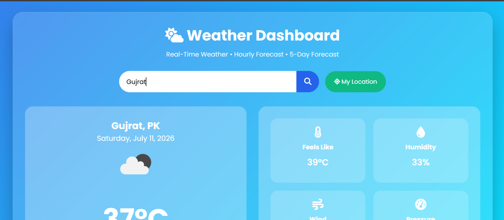
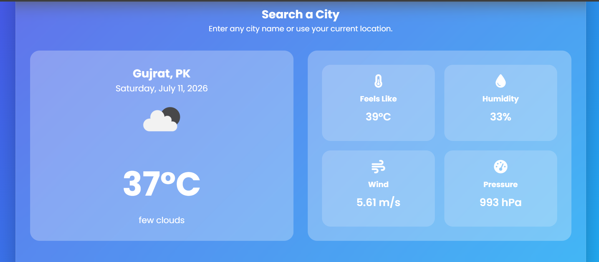
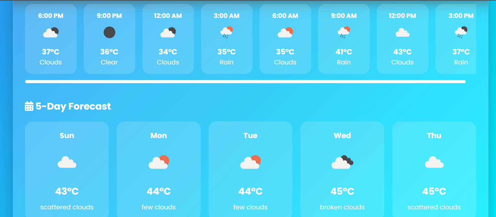

<div align="center">

# 🌤 Interactive Weather Dashboard

### A Responsive Real-Time Weather App with Location Detection & Forecasting

Search Any City • Auto-Detect Location • Hourly & 5-Day Forecast — All in One Clean Dashboard

<p>


</p>

</div>

---

## 📖 Overview

**Interactive Weather Dashboard** is a responsive web application built with **HTML, CSS, and vanilla JavaScript** that gives users real-time weather information at a glance. Users can search for any city or let the app automatically detect their current location, and instantly see the current conditions, an hourly forecast, and a full 5-day outlook.

The app consumes the **OpenWeather API** via the Fetch API and is wrapped in a clean, glassmorphism-styled interface with proper loading, error, and empty states. To keep things fast, the latest successful weather response is cached in the browser using **localStorage**, so returning visitors get an instant view while fresh data loads in the background.

---

## 🎯 Objectives

- Display current weather conditions
- Show an hourly weather forecast
- Show a 5-day weather forecast
- Automatically detect the user's current location
- Allow searching weather by city name
- Improve user experience through caching and responsive design

---

## 🚀 Key Highlights

| | | |
|---|---|---|
| ✅ Real-Time Weather Data | ✅ Hourly & 5-Day Forecasts | ✅ Automatic Location Detection |
| ✅ Search by City Name | ✅ Glassmorphism UI | ✅ LocalStorage Caching |
| ✅ Loading / Error / Empty States | ✅ Fully Responsive | ✅ Zero Frameworks — Pure JS |

---

## 📸 Project Preview

### 📊 Dashboard Views




---

## 🏗 System Architecture

```
                   User (Browser)
                        │
                        ▼
        HTML5 + CSS3 (Glassmorphism UI)
                        │
              Vanilla JavaScript (ES6)
                        │
        ┌───────────────┼────────────────┐
        │               │                │
        ▼               ▼                ▼
  Geolocation API   OpenWeather API   localStorage
  (Auto Location)   (Weather Data)     (Caching)
```

---

## 🔄 How It Works

**Step 1 — Check Cache**
On load, the app first checks whether weather data already exists in `localStorage`. If cached data is found, it's displayed immediately for a fast first paint.

**Step 2 — Request Location Access**
The browser asks the user for permission to access their current location via the **Geolocation API**.

**Step 3 — Get Coordinates**
If permission is granted, the app retrieves the device's latitude and longitude.

**Step 4 — Fetch Current Weather**
The coordinates are used to request current weather data from the **OpenWeather API**.

**Step 5 — Render Weather**
The current weather response is displayed on the dashboard.

**Step 6 — Fetch Forecast Data**
The app requests the forecast endpoint and renders both the **Hourly Forecast** and the **5-Day Forecast**.

**Step 7 — Cache the Response**
The latest successful response is saved to `localStorage`, so the next visit loads instantly.

---

## 🎯 Core Features

### 🌡 Current Weather
Displays temperature, humidity, pressure, wind speed, weather description, and a matching weather icon.

### ⏱ Hourly Forecast
3-hour interval breakdowns pulled from the Forecast API, giving a clear short-term outlook.

### 📅 5-Day Forecast
A full 5-day weather outlook so users can plan ahead.

### 📍 Automatic Location Detection
Uses the Geolocation API to instantly show weather for the user's current location, with no manual input required.

### 🔍 Search by City
Users can search and view weather for any city worldwide.

### 💾 LocalStorage Caching
The latest successful response is cached locally, reducing API calls and providing instant load on repeat visits.

### 🎨 Glassmorphism Interface
A modern, animated, frosted-glass-style UI built with pure CSS.

---

## 🧩 State Management

The application manages four distinct UI states:

| State | Description |
|---|---|
| **Loading** | Shown while weather data is being fetched |
| **Success** | Displays current weather and both forecasts |
| **Error** | Shown when the city is invalid, the connection fails, or the API request fails |
| **Empty** | Shown before the user searches for a city or if location access is denied |

---

## 📡 APIs Used

### Current Weather API
Returns:
- Temperature
- Humidity
- Pressure
- Wind Speed
- Weather Description
- Weather Icon

### Forecast API
Returns:
- 3-hour weather intervals
- Hourly Forecast
- 5-Day Forecast

---

## 📱 Responsive Design

The dashboard is fully responsive and optimized for desktop, laptop, tablet, and mobile devices. CSS media queries automatically adjust:

- Layout
- Card sizes
- Buttons
- Forecast grid
- Typography

---

## 🛠 Technologies Used

| Technology | Purpose |
|---|---|
| HTML5 | Page structure and semantic markup |
| CSS3 | Styling, glassmorphism effects, responsive layout |
| JavaScript (ES6) | Application logic and state handling |
| Fetch API | Making HTTP requests to the OpenWeather API |
| DOM Manipulation | Dynamically rendering weather data |
| Geolocation API | Detecting the user's current location |
| Local Storage | Caching the latest weather response |
| OpenWeather API | Source of real-time weather and forecast data |
| Font Awesome | Weather and UI icons |
| Google Fonts (Poppins) | Typography |

### JavaScript Concepts Applied
Variables · Functions · Async/Await · Fetch API · Promises · Event Listeners · DOM Manipulation · Template Literals · Arrays · Loops · Objects · JSON · localStorage · Geolocation API · Error Handling · Conditional Statements

---

## 📂 Project Structure

```
weather-dashboard/
│
├── assets/
│   ├── Dashboard1.png
│   ├── Dashboard2.png
│   └── Dashboard3.png
│
├── index.html
├── style.css
├── script.js
└── README.md
```

---

## 🚀 Getting Started

Since this is a fully client-side application, no build tools or server setup are required.

**1. Clone the repository**
```bash
git clone https://github.com/abdulqadeersikandar-pixel/weather-dashboard.git
cd weather-dashboard
```

**2. Add your OpenWeather API key**

Open `script.js` and set your API key:
```js
const API_KEY = "your_openweather_api_key_here";
```

> 💡 Get a free API key at [openweathermap.org/api](https://openweathermap.org/api).

**3. Open the app**
```bash
open index.html   # or double-click the file in any modern browser
```

---

## 🔄 User Flow

1. Open the application
2. Allow location access, or search for a city
3. Current weather is displayed
4. Hourly forecast is shown
5. 5-day forecast is displayed
6. Weather data is cached
7. On future visits, cached data loads instantly while fresh data is fetched in the background

---

## 🧗 Challenges Faced

- Integrating multiple API endpoints (current weather + forecast)
- Handling invalid city searches gracefully
- Designing a fully responsive interface
- Managing asynchronous API requests cleanly
- Implementing reliable localStorage caching
- Correctly parsing and displaying hourly vs. daily forecast data

---

## ⭐ Future Improvements

- Dark Mode
- Favorite cities list
- Interactive weather maps
- Air Quality Index (AQI)
- UV Index
- Sunrise & sunset times
- Weather alerts/notifications
- Temperature unit toggle (°C / °F)
- Multi-language support

---

## 🤝 Contributing

Contributions are always welcome!

1. Fork the repository
2. Create a new feature branch
3. Commit your changes
4. Push your branch
5. Open a pull request

```bash
git checkout -b feature/new-feature
git commit -m "Add new feature"
git push origin feature/new-feature
```

---

## 📝 Conclusion

The Interactive Weather Dashboard demonstrates practical front-end development skills by integrating external APIs, browser storage, responsive UI design, asynchronous JavaScript, and real-time data rendering. It reflects a real-world workflow commonly used in modern web development and serves as a strong portfolio project for internships and junior front-end developer roles.

---

<div align="center">

## 👨‍💻 Author

**Abdul Qadeer Sikandar**
Software Engineering Student · University of Gujrat
Full Stack Web Developer

[💼 LinkedIn](https://www.linkedin.com/in/abdulqadeersikandar) · [💻 GitHub](https://github.com/abdulqadeersikandar-pixel)

---

### 🌟 Support

If you found this project useful, please consider ⭐ starring the repository, 🍴 forking it, and 📢 sharing it with others.

### 📜 License

Licensed under the **MIT License** — free to use, modify, and distribute for educational purposes.

**Made with ❤️ by Abdul Qadeer Sikandar**

</div>
